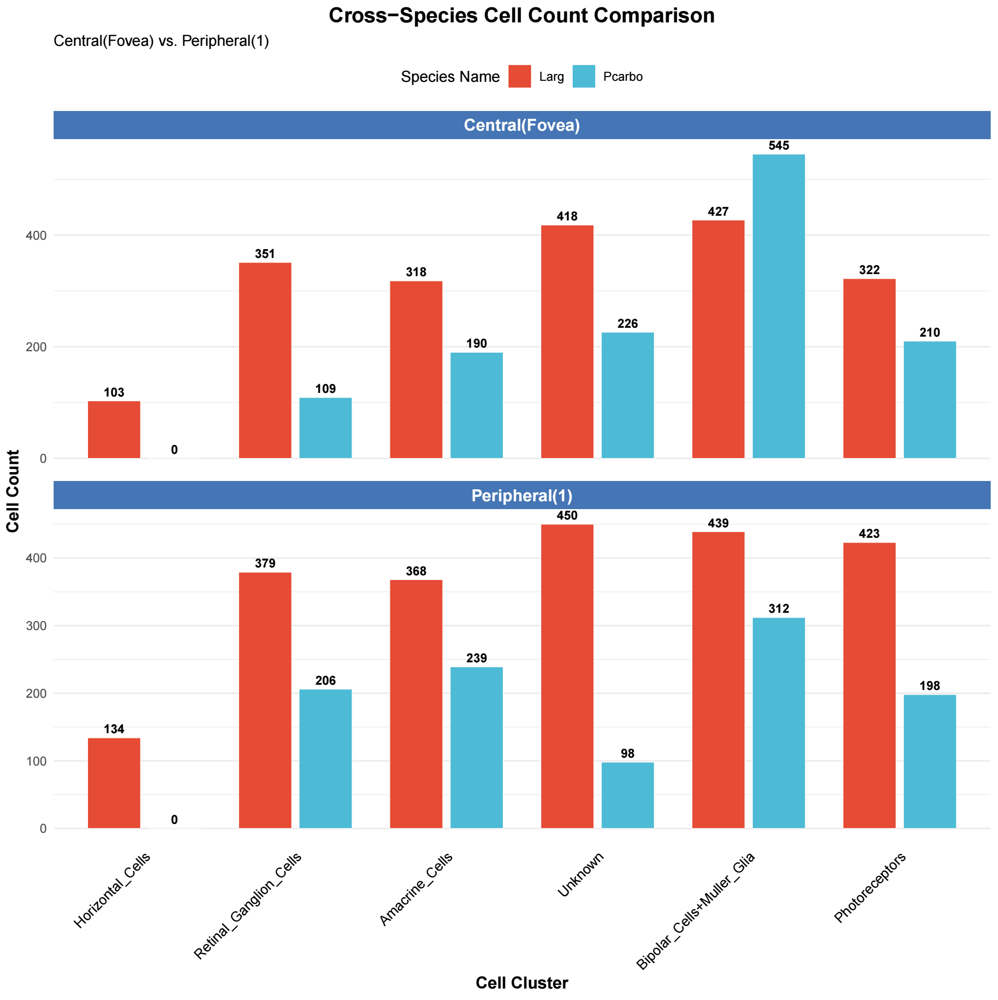

本文介绍在绘制完鸟类视网膜结构分区细胞数目/比例统计后（数据储存在 `meta_info.txt` 中），进行物种之间的比较。

以银鸥（Larus argentatus）和鸬鹚（Phalacrocorax carbo）为例，可用如下代码提取、合并 `meta_info` 的信息，并绘制多物种视网膜中央区与旁区细胞数目的统计图进行比较：

```R
library(ggplot2)
library(dplyr)
library(ggforce)
library(tidyr)
library(ggsci)

merge_meta <- function(df, species_name){
    df %>% 
      mutate(
        species = species_name,
        comparison_group = case_when(
            region_lev1 == "fovea_central" ~ "Central(Fovea)",
            region == "peripheral1" ~ "Peripheral(1)",
            TRUE ~ NA_character_
        )
      ) %>%
      filter(!is.na(comparison_group)) %>%
      group_by(species, comparison_group, cluster) %>%
      summarise(cell_count = n(), .groups = "drop") %>%
      select(species, comparison_group, cluster, cell_count)
}

meta_info_Larg <- read.table("./Larg_meta_info.txt", header = TRUE, sep = "\t", stringsAsFactors = FALSE)
meta_info_Pcarbo <- read.table(".Pcarbo_meta_info.txt", header = TRUE, sep = "\t", stringsAsFactors = FALSE)

plot_data <- rbind(
    merge_meta(meta_info_Larg, "Larg"),
    merge_meta(meta_info_Pcarbo, "Pcarbo")
) %>%
  complete(species, comparison_group, cluster, fill = list(cell_count = 0))

p <- ggplot(plot_data, aes(x = cluster, y = cell_count, fill = species)) +
  geom_bar(stat = "identity",
           position = position_dodge(width = 0.8),
           width = 0.7,
           color = "white",
           linewidth = 0.2) +
  geom_text(
    aes(label = cell_count),
    position = position_dodge(width = 0.8),
    vjust = -0.5,
    size = 3,
    fontface = "bold"
  ) +
  facet_wrap(~comparison_group, scales = "free_y", ncol = 1) +
  scale_fill_npg() +
  labs(
    title = "Cross-Species Cell Count Comparison",
    subtitle = "Central(Fovea) vs. Peripheral(1)",
    x = "Cell Cluster",
    y = "Cell Count",
    fill = "Species Name"
  ) +
  theme_minimal() +
  theme(
    axis.text.x = element_text(angle = 45, hjust = 1, vjust = 1, size = 10, color = "black"),
    axis.title = element_text(face = "bold", size = 12),
    strip.text = element_text(face = "bold", size = 12, color = "white"),
    strip.background = element_rect(fill = "#4575b4", color = NA),
    panel.grid.major.x = element_blank(),
    legend.position = "top",
    plot.title = element_text(hjust = 0.5, face = "bold", size = 15)
  )

dev.off()

ggsave("Larg_Pcarbo_comparison.pdf", p, width = 10, height = 10)

```

运行后，即可生成 `Larg_Pcarbo_comparison.pdf` 文件，展示银鸥和鸬鹚在视网膜中央区与旁区的细胞数目比较结果，如下图所示：

